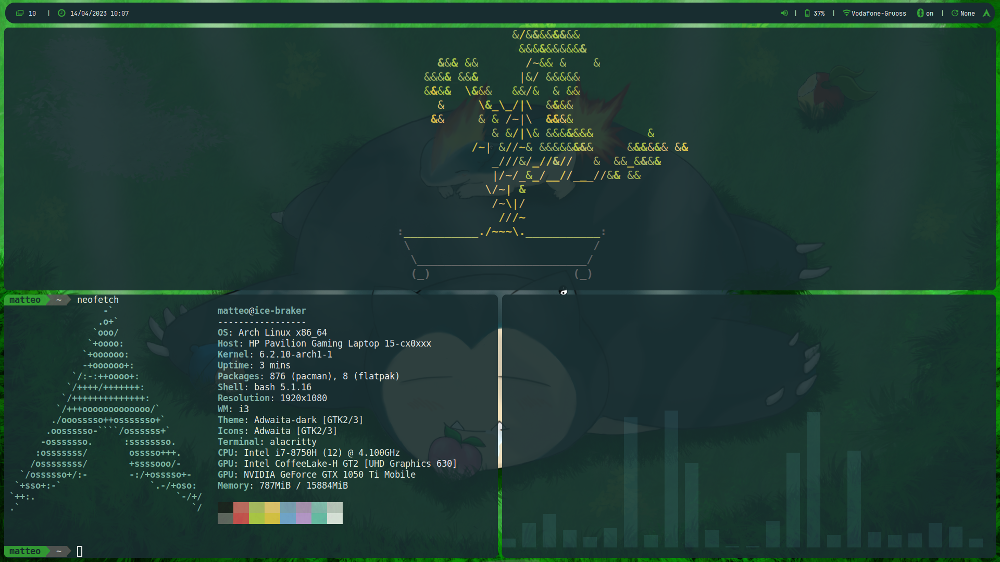

# BIG-TUX-SETUP
 - 
- linux config files backups for arch installation

### INSTALLATION 
- boot live cd 
- pacman -Syu
- install git
- clone repo
- set credential on `big-tux-setup/archinstall_files/user_credentials.json`
- run  `archinstall --config "big-tux-setup/archinstall_files/user_configuration.json"  --creds "big-tux-setup/archinstall_files/user_credentials.json"`
### PREVIEW
  
##### check also my [vscode theme](https://github.com/carnivuth/snorlax-theme)
##### [usefull scripts](https://github.com/carnivuth/scripts)
